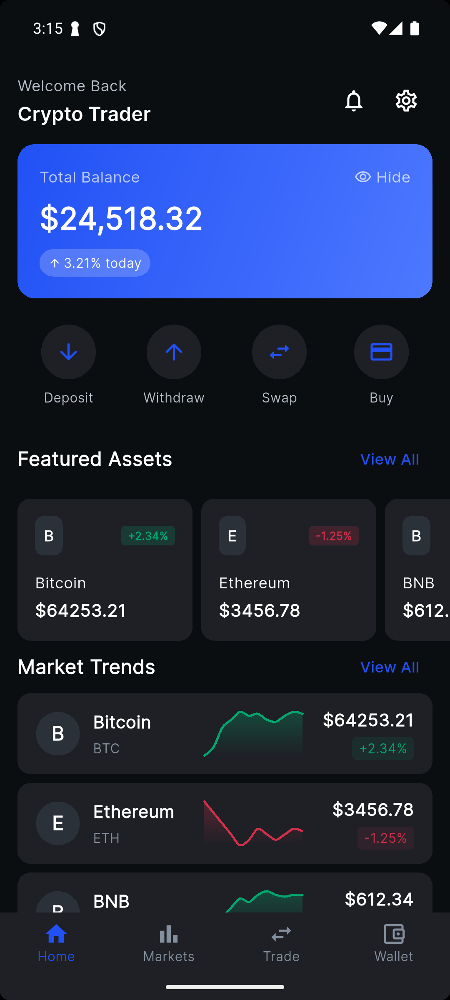
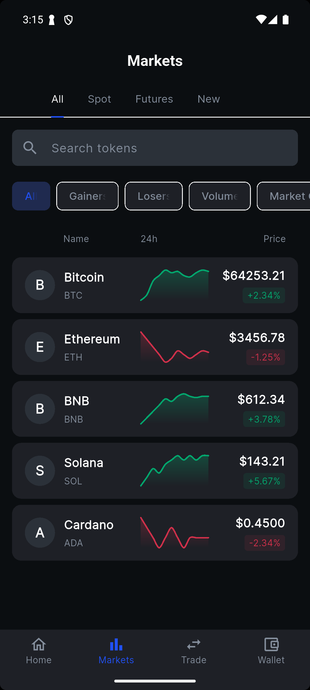
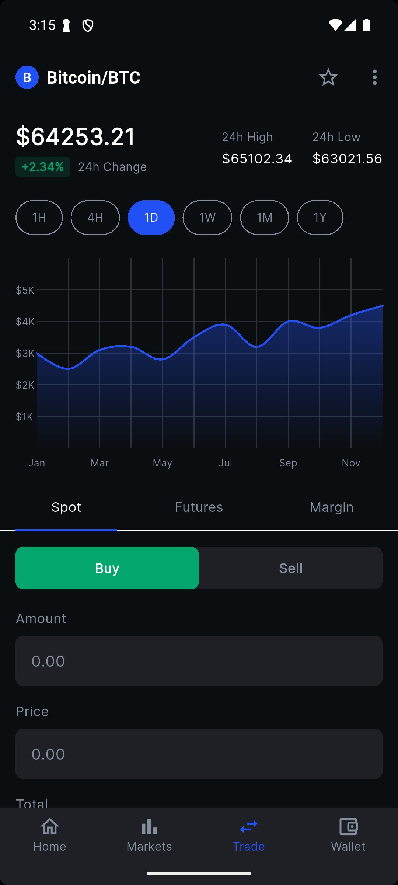
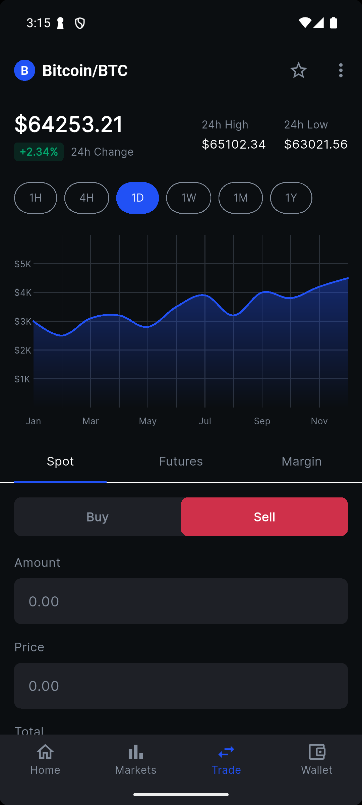
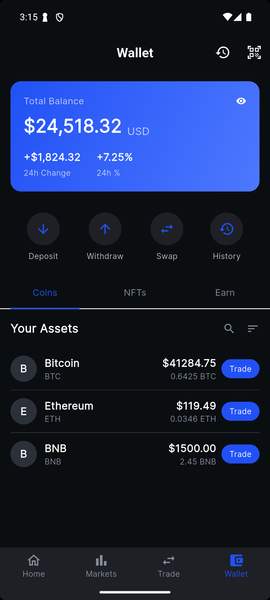
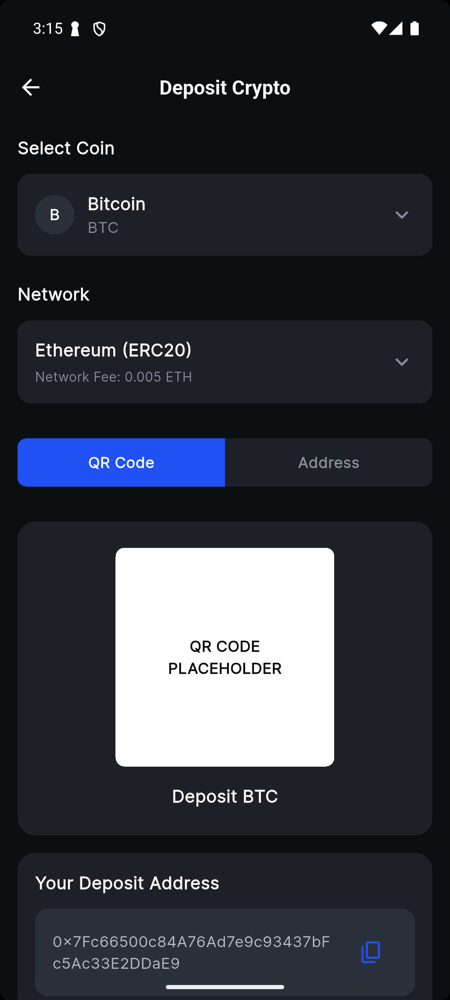
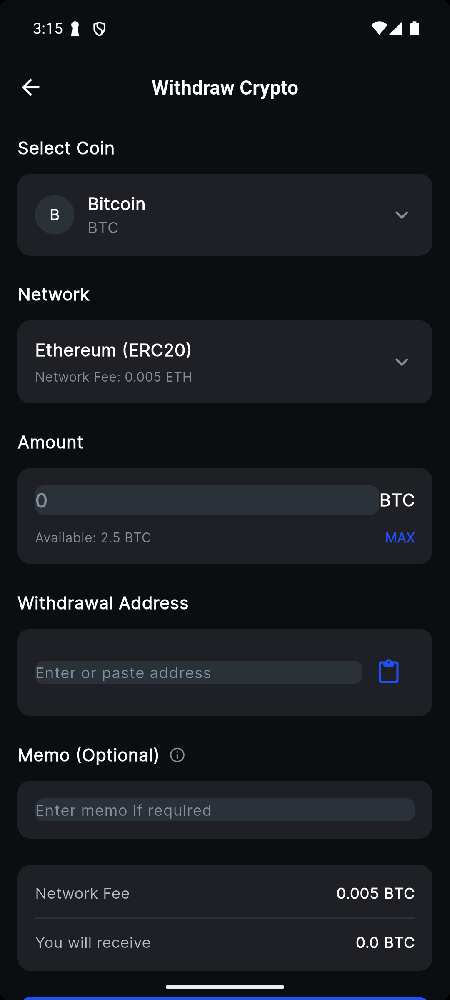
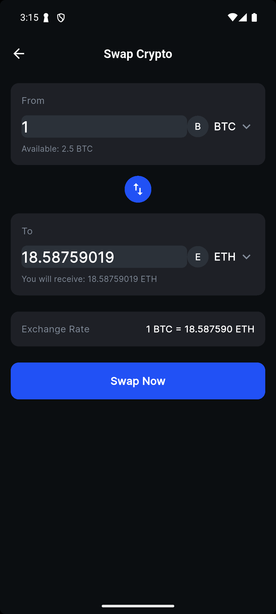
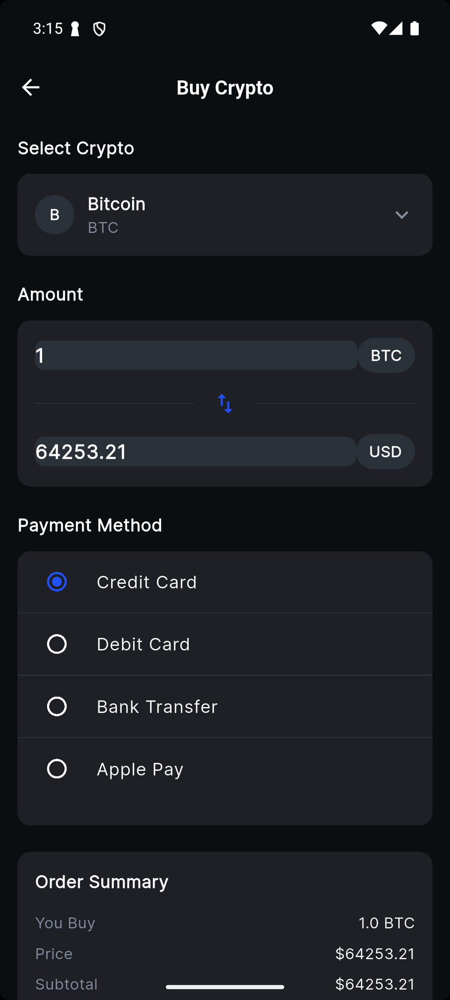
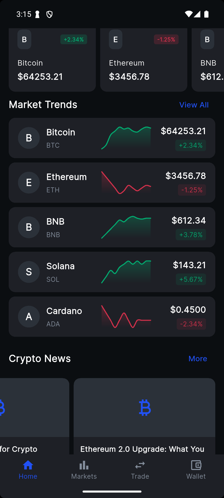

# CryptoTrader Flutter - Modern Cryptocurrency Exchange App UI


## 📱 Modern Cryptocurrency Trading Platform UI

CryptoTrader is a sleek, professional cryptocurrency exchange mobile application UI built with Flutter. This project showcases a comprehensive, visually appealing trading interface inspired by leading exchanges like Binance and OKX, featuring a complete set of screens for all essential cryptocurrency trading operations.



## ✨ Features

### 🏠 Home Screen
- Modern dashboard with portfolio overview and balance tracking
- Real-time market trends and price charts
- Featured assets carousel
- Latest cryptocurrency news section
- Quick action buttons for all trading operations

### 💰 Deposit Screen
- Cryptocurrency selection with search functionality
- Network selection for deposits 
- QR code display for wallet address
- Copy-to-clipboard functionality for addresses
- Important deposit information and warnings

### 📤 Withdraw Screen
- Cryptocurrency and network selection
- Amount input with MAX button functionality
- Withdrawal address field with paste support
- Optional memo/tag field for exchange deposits
- Fee calculation and withdrawal confirmation
- Transaction success confirmation

### 💱 Swap Screen
- Direct cryptocurrency swapping interface
- Real-time exchange rate calculation
- From/To cryptocurrency selection
- Quick swap button to reverse currencies
- Swap confirmation and success dialogs

### 💳 Buy Screen
- Cryptocurrency purchase interface
- Fiat amount input with live conversion
- Multiple payment method options
- Order summary with fees breakdown
- Purchase confirmation process

## 🛠️ Technology Stack

- **Framework**: Flutter
- **Language**: Dart
- **Architecture**: Clean, component-based UI architecture
- **State Management**: Local state with StatefulWidget
- **UI/UX**: Custom-designed dark theme optimized for cryptocurrency trading

## 🚀 Getting Started

### Prerequisites

- Flutter SDK (3.0 or higher)
- Dart SDK (2.17 or higher)
- Android Studio / VS Code with Flutter extensions
- iOS simulator / Android emulator or physical device

### Installation

1. Clone the repository
   ```bash
   git clone https://github.com/Hamed233/CryptoTrader-Flutter---Modern-Cryptocurrency-Exchange-App-UI
   ```

2. Navigate to project directory
   ```bash
   cd crypto_exchange_app
   ```

3. Install dependencies
   ```bash
   flutter pub get
   ```

4. Run the app
   ```bash
   flutter run
   ```

## 📸 Screenshots

### Home Screen


### Deposit Screen



### Withdraw Screen



### Swap Screen



### Buy Screen




## 🔜 Roadmap

- [ ] Add authentication and user profile management
- [ ] Implement live cryptocurrency price API integration
- [ ] Add chart visualization for price history
- [ ] Create order book and trade history screens
- [ ] Develop settings and preferences screen
- [ ] Add dark/light theme toggle
- [ ] Implement biometric authentication
- [ ] Add push notifications for price alerts

## 📄 License

This project is licensed under the MIT License - see the [LICENSE](LICENSE) file for details.

## 📊 Keywords

cryptocurrency exchange app, flutter crypto trading UI, mobile trading platform, bitcoin trading app, ethereum wallet UI, crypto portfolio tracker, flutter dark theme, cryptocurrency mobile app, digital asset exchange, crypto wallet design, modern trading interface, flutter UI components, crypto market app, blockchain mobile application, cryptocurrency price tracker

## 🙏 Acknowledgements

- Design inspiration from leading exchanges like Binance and OKX
- [Flutter](https://flutter.dev/) for the amazing cross-platform framework
- [Material Design](https://material.io/) for UI components
